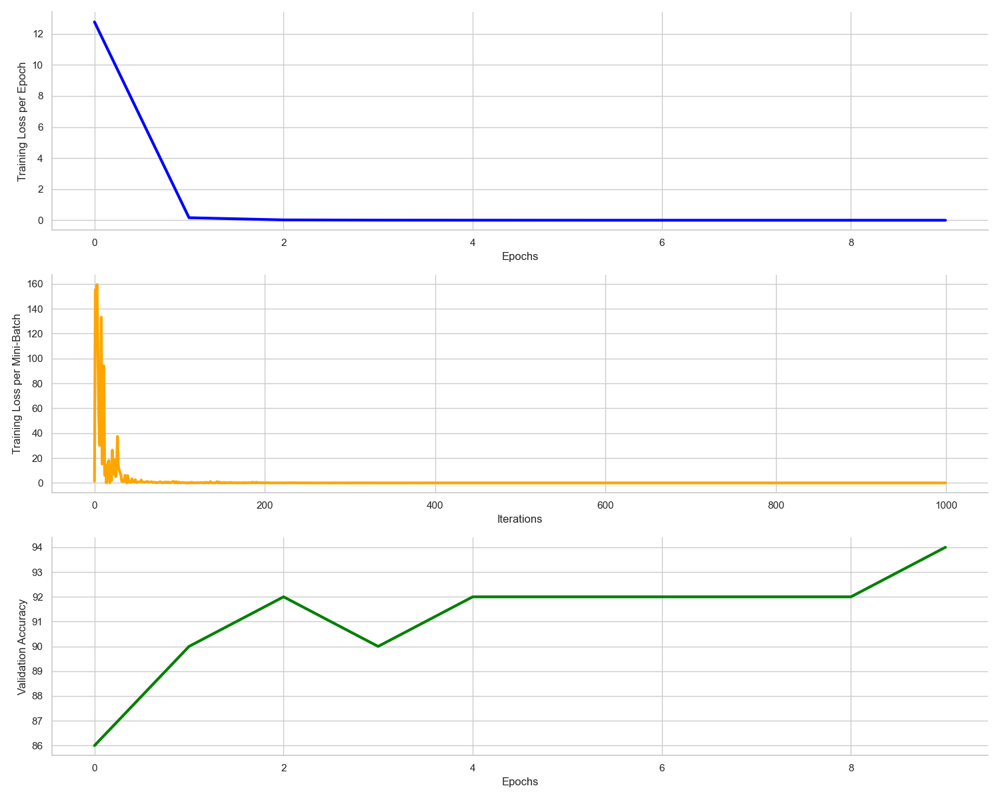

## Project Overview
A simple CNN model for animal classification with animal images using PyTorch

Goal: Classify animal species from images (zebra, elephant, giraffe, lion, hippo).

Approach: Shifted from animal crowds to single-animal images for better results.

Outcome: Achieved 90% validation accuracy and 80% test accuracy with SimpleCNN.

Challenges

Animal Crowds:
Issues with background noise, varying art styles, and partial animal bodies.
Models struggled with insufficient data and complex images.

Complex Models (VGG16):
Underfitting with small datasets and large model architectures.

## Quick Review of Results
Demo/Final_Project.ipynb
Demo/Final_project.pdf

## Data preparation
Animal Crowd Images : DALL-E-3 1024x1024 100imgs 

Single Animal Images: DALL-E-2 256x256 500 imgs

Real World Animal Images
13 imgs, just for quick verfication of the model's generalization


## Setup Instructions
- Python 3.12+
- PyTorch 2.0+

## Usage
1. Install dependencies:
   ```bash
   pip install -r requirements.txt

## How to Run
There are three main params.
should_train_model = True # Control whether to train the model again or use saved best model checkpoint
should_plot_results_grid = True # Control whether to plot the results grid, not valid for real animal images
use_real_animal_images = False # if True, will use real animal images for test validation

If you want to use saved best model checkpoint to test on real data, follow below settings.
should_train_model = False
should_plot_results_grid = False # MUST!
use_real_animal_images = True
You can also add more real animal images into data/realAnimalPics folder but it must be RGB image in .png format.

## Expected Output

Training Progress Validation Results with plot




Test Results with plot


Pre-trained Model Link
Not applicable, Both AnimalSpeciesCNN and VGG16 are underfitting and not adopted for this task


